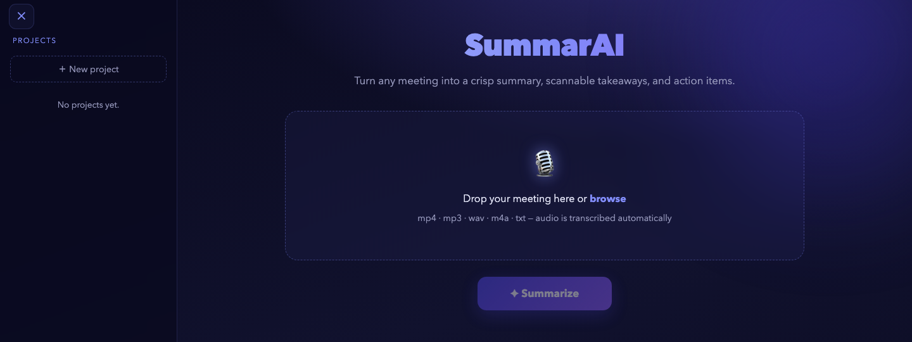
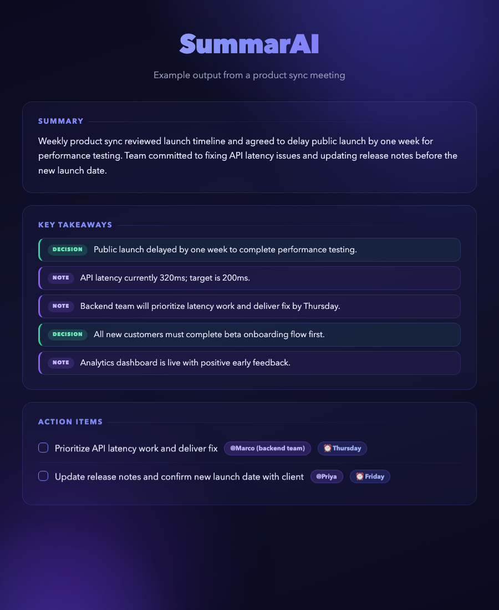
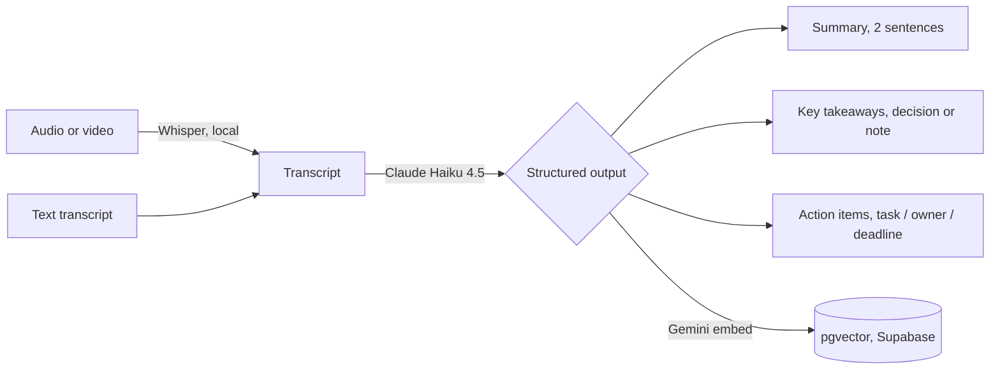
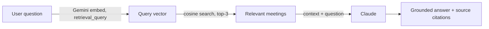

<div align="center">

# SummarAI

### Turn any meeting recording into a summary, decisions, and owned action items.




</div>

---

## What it is

SummarAI is a web app that turns a meeting recording into a written record people actually use. You upload an audio file (or paste a transcript), and within a couple of minutes it gives back three things: a two-sentence summary, the key takeaways (each marked as a **decision** or a **note**), and a list of **action items** showing the task, who owns it, and any deadline. Results can be saved into **projects**, so a team keeps a history of what was agreed across all their meetings.

Once meetings are saved to a project, you can **ask questions about them in natural language** — "what did we decide about the budget?" or "who owns the design task?" — and get a grounded, cited answer drawn from the actual meeting record. This is powered by a Retrieval-Augmented Generation (RAG) layer built on top of the project archive.

The goal was not to build another transcription tool. Plenty of those exist. SummarAI reads the conversation and pulls out the parts that matter after the call: the decisions, the to-dos, and the institutional memory across meetings.

## Example output

A real run on a short product-sync meeting:

<div align="center">

</div>

## How it works

The system has two layers: a **core summarisation pipeline** that runs on every upload, and a **RAG layer** that activates once meetings are saved to a project.

### Core pipeline



1. **Speech to text.** `faster-whisper` (the `base.en` model) transcribes the audio locally on the CPU. If you upload a text transcript, this step is skipped.
2. **Summarise and extract.** The transcript goes to Claude Haiku 4.5 with a strict output schema, which guarantees the result is always a clean summary, typed takeaways, and action items.
3. **Embed and store.** When a result is saved to a project, the full summarisation record is embedded with Gemini `embedding-001` (1536-dimensional vectors) and stored in Supabase via the `pgvector` extension. This feeds the RAG layer.

### RAG layer — Ask about your meetings



When you type a question in the **Ask about this project** panel:

1. The question is embedded using `retrieval_query` task type (asymmetric from the document embeddings, which improves retrieval quality).
2. The top-3 most semantically similar meetings are retrieved from Supabase via the `match_summarizations` PostgreSQL function.
3. Those meetings are passed as structured context to Claude Haiku 4.5, which is instructed to answer from the context only and cite its sources.
4. The response includes the answer and source chips showing meeting title, date, and cosine similarity score.

## Results

We evaluated the summarisation stage on **30 real meetings from the AMI Meeting Corpus**, comparing SummarAI's output against the **human-written summaries** that ship with the corpus. No hand-labelling: we reuse professional human annotations, which keeps the evaluation honest.

| Metric | Score |
|---|---|
| ROUGE-1 | 0.34 |
| ROUGE-2 | 0.06 |
| ROUGE-L | 0.15 |
| Action items recovered (recall) | 42% (28 of 66) |

Working end to end from raw audio, the system recovers about four in ten of the action items a human annotator recorded. Full methodology and per-meeting results are in [`data/eval/`](data/eval/).

## Features

- Upload audio or video (`.mp4`, `.mp3`, `.wav`, `.m4a`, `.webm`, `.ogg`, `.flac`) or a text transcript (`.txt`, `.md`, `.vtt`, `.srt`).
- Local transcription — the audio never leaves your machine.
- Two-sentence summary, plus takeaways tagged decision or note, plus action items with owner and deadline.
- Save results into projects with a timeline view.
- **Ask questions in natural language** about a project's full meeting history — RAG-powered, grounded, cited answers.
- Clean, responsive interface that works on a phone, with a collapsible projects panel.

## Tech stack

| Part | Choice |
|---|---|
| Backend | Python, FastAPI ([`src/app.py`](src/app.py)) |
| Transcription | [`faster-whisper`](https://github.com/SYSTRAN/faster-whisper), `base.en`, local CPU |
| Summarisation | Claude Haiku 4.5, structured JSON output |
| Embeddings | Gemini `embedding-001` (768 dims, via `google-genai`) |
| Vector search | Supabase + `pgvector`, HNSW index, cosine similarity |
| Frontend | Single-page vanilla JavaScript and CSS ([`src/static/index.html`](src/static/index.html)) |
| Persistence | Supabase (Postgres) |

## Run it locally

```bash
git clone https://github.com/tono2002/nlp-project.git
cd nlp-project
python3 -m venv .venv && source .venv/bin/activate
pip install -r requirements.txt
cp .env.example .env          # then fill in your keys (see below)
uvicorn src.app:app --reload
```

Open `http://localhost:8000`, drop in a recording, and click Summarise.

### Environment variables

Open `.env` and set:

```
ANTHROPIC_API_KEY=sk-ant-...      # required — summarisation
GEMINI_API_KEY=AIza...            # required for RAG — get free at aistudio.google.com
SUPABASE_URL=https://...          # optional — defaults ship in app.py
SUPABASE_ANON_KEY=eyJ...          # optional — defaults ship in app.py
```

### Database setup (for RAG)

Run [`supabase_schema.sql`](supabase_schema.sql) first, then [`supabase_schema_rag.sql`](supabase_schema_rag.sql) in the Supabase SQL Editor. The second migration enables `pgvector`, adds the `embedding` column, and creates the `match_summarizations` search function.

Full details and troubleshooting are in the [installation guide](docs/installation_guide.md).

## Deliverables

| Deliverable | Where |
|---|---|
| Technical report | [deliverables/technical_report.md](deliverables/technical_report.md) |
| Executive summary (one page) | [deliverables/executive_summary.md](deliverables/executive_summary.md) |
| Presentation slides | [deliverables/slides.md](deliverables/slides.md) |
| User manual | [docs/user_manual.md](docs/user_manual.md) |
| Installation guide | [docs/installation_guide.md](docs/installation_guide.md) |
| Evaluation (data, script, results) | [data/eval/](data/eval/) |
| Prompt documentation | [prompts/system_prompt.md](prompts/system_prompt.md) |
| Individual reflections | [deliverables/reflections/](deliverables/reflections/) |

## Honest limitations

- **It does not know who is speaking.** The transcription has no speaker labels, so when nobody is named the action-item owner is left blank rather than guessed. This is the clearest thing to improve next.
- **It assumes English audio.** The transcription model is tuned for English.
- **Audio quality matters.** Heavy noise, strong accents, or people talking over each other lower transcription accuracy, and that carries through to the summary.
- **RAG requires saved meetings.** The Ask panel only returns answers once meetings have been saved to a project. Meetings saved before the RAG migration was applied can be back-filled using `embed_existing.py`.

## Team

Antonio · Martí · Bojana · Smaragda · Jo

NLP Group Assignment, Option 1: Application Development.
